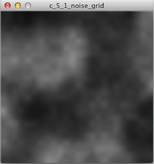
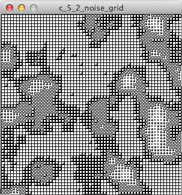
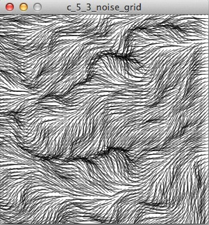
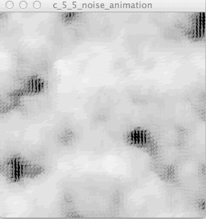
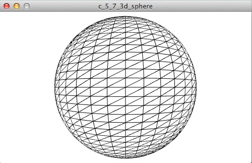
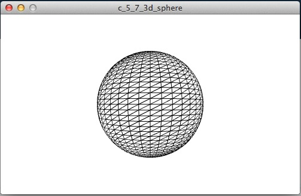
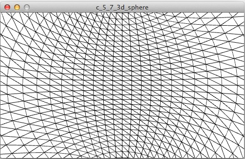

# Chapter5 次元を加える
Processingがどのように3次元の描画をレンダリングするか学ぶ。

## 主役はパーリンノイズ
レンダリングにはパーリンノイズが主役となる。Chapter4までは`noise`関数に1つの引数を指定し、1次元のノイズを生成していただけだが、今回は更に次元を加えてみる。

# 2次元のノイズ
2次元は1次元と見方が異なる。概念的には線から平面になる。

1次元のノイズは水平線上に見える山脈のように揺らぐ線のようであり、2次元のノイズは真上から山脈を見下ろしている面のようになる。

## ノイズグリッドを作る
説明だけだと解り辛いため、例を見せる。

**c_5_1_noise_grid/c_5_1_noise_grid.pde**

```processing
// 描画ウィンドウの幅と高さを指定する
size(300, 300);
// 滑らかな描画（アンチエイリアス）を有効にする
smooth();
// 背景色を指定
background(255);
float xStart = random(10);
float xNoise = xStart;
float yNoise = random(10);

for (int y = 0; y <= height; y += 1) {
    // シード値に0.01を加算
    yNoise += 0.01;
    // 各列の開始時点でxNoiseをリセット
    xNoise = xStart;
    for (int x = 0; x <= width; x += 1) {
        // シード値に0.01を加算
        xNoise += 0.01;
        // xとyのそれぞれの位置でnoise関数が返す値をアルファ値として利用する
        int alph = int(noise(xNoise, yNoise) * 255);
        stroke(0, alph);
        line(x, y, x + 1, y + 1);
    }   
}
```

上記のコードは1ピクセルずつごく短い線を描画しているものであり、300×300の正方形のピクセル上をループする。１ピクセル毎にシード値（乱数を生成するときの最初の設定値）に0.01を加算し、各列の開始時点でxのシード値を元の値に戻す。xとyのそれぞれの位置で`noise`関数が返す値は、各位置で描画する線のアルファ値として利用するため視覚化される。

以下のような2Dパーリンノイズが描画される。



## ノイズの視覚化
`c_5_1_noise_grid.pde`ではアルファ値がノイズの値として視覚化されたが、別のものをノイズの値として視覚化する。

**c_5_2_noise_grid/c_5_2_noise_grid.pde**

```processing
float xStart, xNoise, yNoise;

void setup() {
    // 描画ウィンドウの幅と高さを指定する
    size(300, 300);
    // 滑らかな描画（アンチエイリアス）を有効にする
    smooth();
    // 背景色を指定
    background(255);
    xStart = random(10);
    xNoise = xStart;
    yNoise = random(10);

    for (int y = 0; y <= height; y += 5) {
        // シード値に0.01を加算
        yNoise += 0.1;
        // 各列の開始時点でxNoiseをリセット
        xNoise = xStart;
        for (int x = 0; x <= width; x += 5) {
            // シード値に0.01を加算
            xNoise += 0.1;
            drawPoint(x, y, noise(xNoise, yNoise));
        }   
    }
}

void drawPoint(float x, float y, float noiseFactor) {
    float len = 10 * noiseFactor;
    rect(x, y , len, len);
}
```

上記のコードは、グリッド毎の正方形の大きさをノイズの値として視覚化するもの。`drawPoint()`関数の`noiseFactor`は正方形の大きさを決めるために利用している。

以下のような2Dパーリンノイズが描画される。



## ノイズの視覚化 その2

上記の`drawPoint()`関数を変更していく。

**c_5_3_noise_grid/c_5_3_noise_grid.pde**

```processing
float xStart, xNoise, yNoise;

void setup() {
    // 描画ウィンドウの幅と高さを指定する
    size(300, 300);
    // 滑らかな描画（アンチエイリアス）を有効にする
    smooth();
    // 背景色を指定
    background(255);
    xStart = random(10);
    xNoise = xStart;
    yNoise = random(10);

    for (int y = 0; y <= height; y += 5) {
        // シード値に0.01を加算
        yNoise += 0.1;
        // 各列の開始時点でxNoiseをリセット
        xNoise = xStart;
        for (int x = 0; x <= width; x += 5) {
            // シード値に0.01を加算
            xNoise += 0.1;
            drawPoint(x, y, noise(xNoise, yNoise));
        }   
    }
}

void drawPoint(float x, float y, float noiseFactor) {
    // 現在の座標を保存する
    pushMatrix();
    // 座標（描画位置）の移動
    translate(x, y);
    // 座標を回転する
    rotate(noiseFactor * radians(360));
    stroke(0, 150);
    line(0, 0, 20, 0);
    // 保存した座標をとりだす
    popMatrix();
}
```

`noiseFactor`の値によって座標を回転させ、その状態で20ピクセルの線を描画するものに変更した。線は真横に向かって描画されるものもあれば、斜めに向かって描画される。

以下のような2Dパーリンノイズが描画される。



## ノイズの視覚化 その3

再び、`drawPoint()`関数を変更していく。

**c_5_4_noise_grid/c_5_4_noise_grid.pde**

```processing
float xStart, xNoise, yNoise;

void setup() {
    // 描画ウィンドウの幅と高さを指定する
    size(300, 300);
    // 滑らかな描画（アンチエイリアス）を有効にする
    smooth();
    // 背景色を指定
    background(0);
    xStart = random(10);
    xNoise = xStart;
    yNoise = random(10);

    for (int y = 0; y <= height; y += 5) {
        // シード値に0.01を加算
        yNoise += 0.1;
        // 各列の開始時点でxNoiseをリセット
        xNoise = xStart;
        for (int x = 0; x <= width; x += 5) {
            // シード値に0.01を加算
            xNoise += 0.1;
            drawPoint(x, y, noise(xNoise, yNoise));
        }   
    }
}

void drawPoint(float x, float y, float noiseFactor) {
    // 現在の座標を保存する
    pushMatrix();
    // 座標（描画位置）の移動
    translate(x, y);
    // 座標を回転する
    rotate(noiseFactor * radians(540));
    float edgeSize = noiseFactor * 35;
    float grey = 150 + (noiseFactor * 120);
    float alph = 150 + (noiseFactor * 120);
    noStroke();
    fill(grey, alph);
    ellipse(0, 0, edgeSize, edgeSize / 2);
    // 保存した座標をとりだす
    popMatrix();
}
```

`noiseFactor`の値を、座標の回転と円のサイズ、色、アルファ値を決めるのに利用して描画をしている。

以下のような2Dパーリンノイズが描画される。


# ノイズアニメーション

ノイズアニメーションの描画には`draw()`関数を利用する。まずは`c_5_4_noise_grid.pde`の一部分変更をし、アニメーションを描画してみる。

**c_5_5_noise_animation/c_5_5_noise_animation.pde**

```processing
float xStart, xNoise, yStart, yNoise;

void setup() {
    // 描画ウィンドウの幅と高さを指定する
    size(300, 300);
    // 滑らかな描画（アンチエイリアス）を有効にする
    smooth();
    // 背景色を指定
    background(0);
    // フレームレートを指定
    frameRate(24);
    // シード値を設定
    xStart = random(10);
    yNoise = random(10);
}

void draw() {
    // 毎フレーム毎にbackgroundをクリアする
    background(0);

    // 毎フレーム毎にシード値を加算する   
    xStart += 0.01;
    yStart += 0.01;

    xNoise = xStart;
    yNoise = yStart;

    for (int y = 0; y <= height; y += 5) {
        // シード値に0.1を加算
        yNoise += 0.1;
        // 各列の開始時点でxNoiseをリセット
        xNoise = xStart;
        for (int x = 0; x <= width; x += 5) {
            // シード値に0.1を加算
            xNoise += 0.1;
            drawPoint(x, y, noise(xNoise, yNoise));
        }   
    }
}

void drawPoint(float x, float y, float noiseFactor) {
    // 現在の座標を保存する
    pushMatrix();
    // 座標（描画位置）の移動
    translate(x, y);
    // 座標を回転する
    rotate(noiseFactor * radians(540));
    float edgeSize = noiseFactor * 35;
    float grey = 150 + (noiseFactor * 120);
    float alph = 150 + (noiseFactor * 120);
    noStroke();
    fill(grey, alph);
    ellipse(0, 0, edgeSize, edgeSize / 2);
    // 保存した座標をとりだす
    popMatrix();
}
```

毎フレーム毎にシード値を加算するようにしたため、雲が左上に漂っていくようなアニメーションになる。

以下のようなノイズアニメーションが描画される。



## 動きにノイズ変動を加える

`c_5_5_noise_animation`は単調な動きのため、動きにノイズ変動を加えてみる。

**c_5_6_noise_animation/c_5_6_noise_animation.pde**

```processing
float xStart, xNoise, yStart, yNoise;
float xStartNoise, yStartNoise;

void setup() {
    // 描画ウィンドウの幅と高さを指定する
    size(300, 300);
    // 滑らかな描画（アンチエイリアス）を有効にする
    smooth();
    // 背景色を指定
    background(0);
    // フレームレートを指定
    frameRate(24);
    // 開始位置にノイズを使う
    xStartNoise = random(20);
    yStartNoise = random(20);
    // シード値を設定
    xStart = random(10);
    yNoise = random(10);
}

void draw() {
    // 毎フレーム毎にbackgroundをクリアする
    background(0);

    // 毎フレーム毎に開始位置のシード値を加算する   
    xStartNoise += 0.01;
    yStartNoise += 0.01;
    xStart += (noise(xStartNoise) * 0.5) - 0.25;
    yStart += (noise(yStartNoise) * 0.5) - 0.25;

    xNoise = xStart;
    yNoise = yStart;

    for (int y = 0; y <= height; y += 5) {
        // シード値に0.1を加算
        yNoise += 0.1;
        // 各列の開始時点でxNoiseをリセット
        xNoise = xStart;
        for (int x = 0; x <= width; x += 5) {
            // シード値に0.1を加算
            xNoise += 0.1;
            drawPoint(x, y, noise(xNoise, yNoise));
        }   
    }
}

void drawPoint(float x, float y, float noiseFactor) {
    // 現在の座標を保存する
    pushMatrix();
    // 座標（描画位置）の移動
    translate(x, y);
    // 座標を回転する
    rotate(noiseFactor * radians(540));
    float edgeSize = noiseFactor * 35;
    float grey = 150 + (noiseFactor * 120);
    float alph = 150 + (noiseFactor * 120);
    noStroke();
    fill(grey, alph);
    ellipse(0, 0, edgeSize, edgeSize / 2);
    // 保存した座標をとりだす
    popMatrix();
}
```

描画の開始位置にシード値を指定したため、`c_5_5_noise_grid.pde`のような左上に単調に動くのではなく、不規則な動きになる。

以下のようなノイズアニメーションが描画される。


# 3次元
3次元を描画するためには`size`関数の3番目の引数を指定する必要がある。

```processing
size(幅, 高さ, MODE);
```

`MODE`と呼ばれる引数であり、どのレンダリングエンジンを利用するか指定するもの。

## 3次元空間に描く
3次元を描画するためには、2次元平面にz（上下どれぐらいの距離があるのか指定する値）という位置情報を追加する必要がある。

Processingには3D構造を表現するために、多くの組み込み関数が存在するため、まずはそれらを利用してみる。まずは`sphere`（三角関数を利用して球体を描画する関数）を利用し`translate`で座標の位置を移動して描画する。

```processing
// OpenGLのライブラリのインポートする
import processing.opengl.*;

void setup() {
    // レンダリングエンジンにOPENGLを指定
    size(500, 300, OPENGL);
    // どれぐらいの細かさで円を描画するか指定
    // (360/40) = 9 のため9度毎に頂点を作る。
    sphereDetail(40);
}

void draw() {
    background(255);
    translate(width/2, height/2, 50);
    sphere(100);
}
```

以下のような3Dの球体が描画される



### `translate`を変更し、見え方の違いを確認する

上記のコードだと2Dの円とあまり変わりがないように見えるため、`translate`の3つめの引数を変更してみる。

上記のコードで`translate`を以下のように変更すれば

```
translate(width/2, height/2, -50);
```

球体が遠ざかったように見えるような描画がされる。



また、`translate`を以下のように変更すれば

```
translate(width/2, height/2, 150);
```

球体の中にいるような描画がされる。

